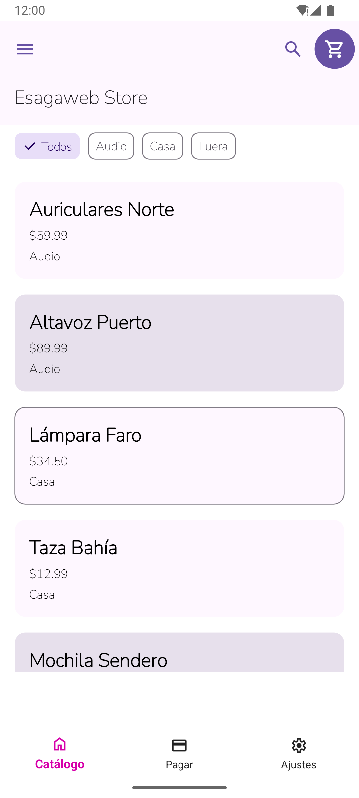
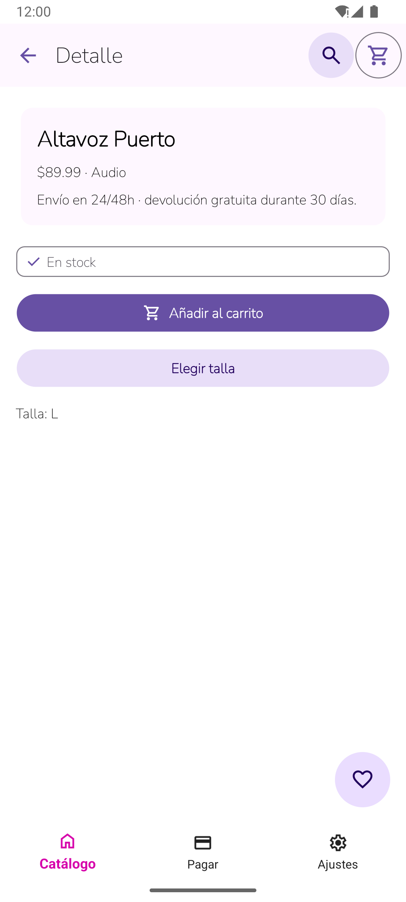
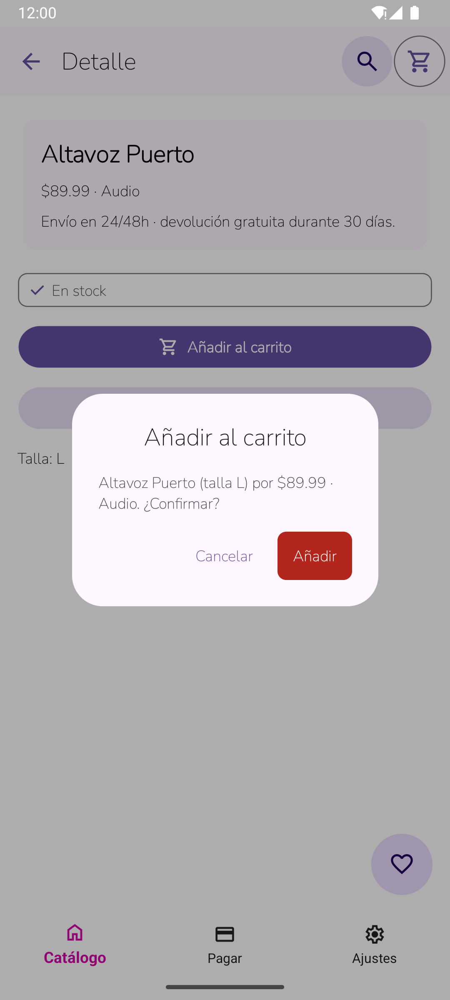
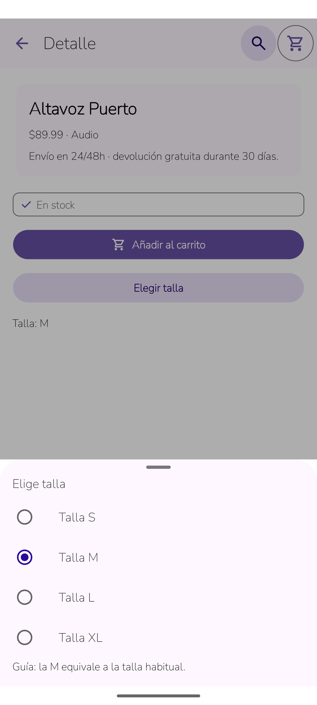
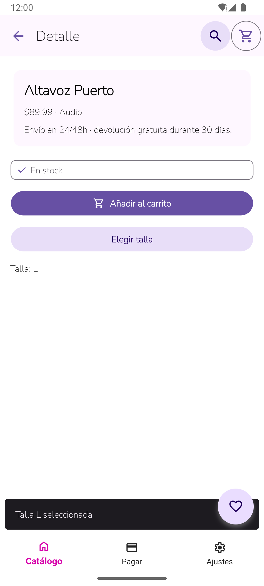
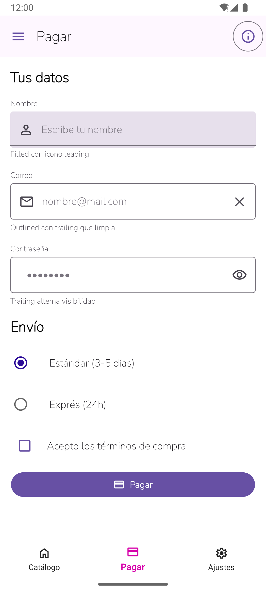
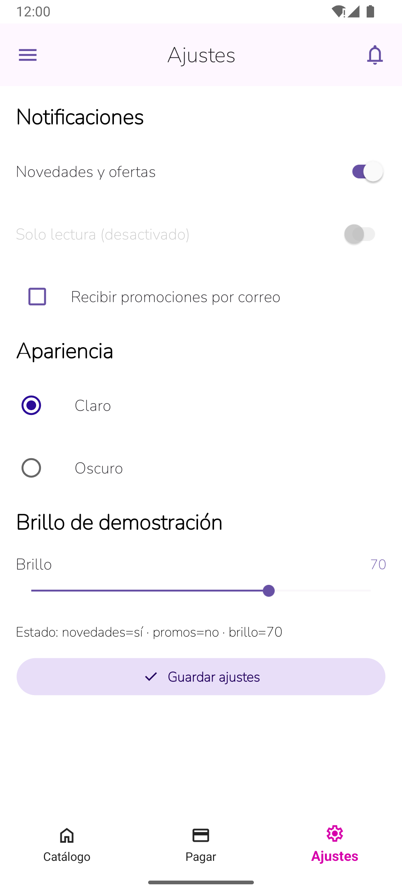
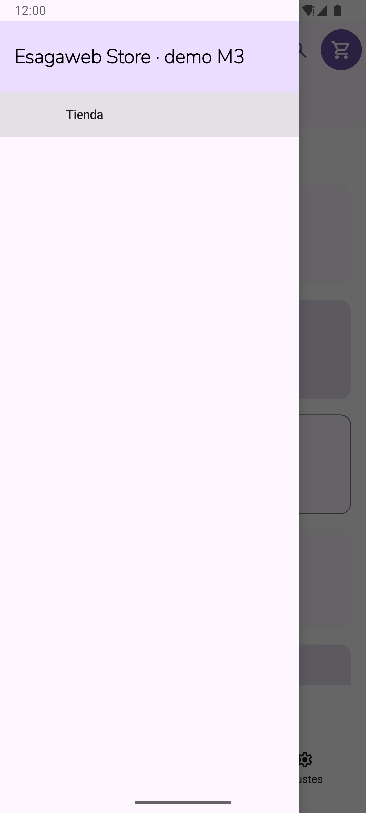
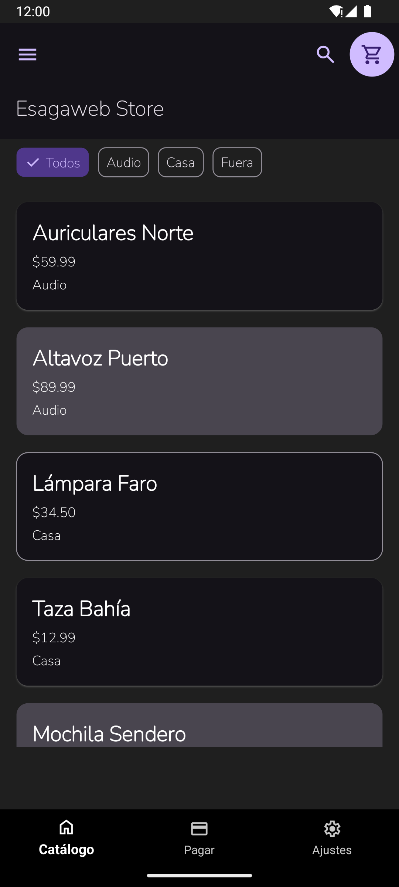
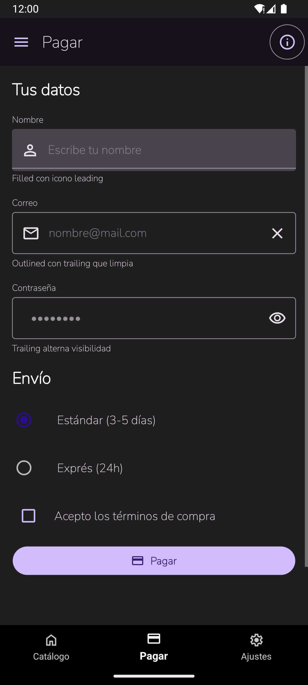

# Esagaweb.Maui.Android

**Material 3 para .NET MAUI Android: la sensación de Flutter, en XAML.**

[](https://github.com/aagarcia/esagaweb.maui.android/actions/workflows/ci.yml)
[](LICENSE)

[](CONTRIBUTING.md)

[English](README.md)

Si has hecho interfaces en Flutter y luego abres un proyecto .NET MAUI, conoces el hueco:
no hay `FloatingActionButton`, ni variantes de `Card`, ni cola de `SnackBar`, ni un esquema
de color Material 3 que cambie solo entre claro y oscuro. **Esagaweb.Maui.Android** llena ese
hueco: 19 controles Material 3 listos para usar, 4.284 iconos, temas claro/oscuro y
breakpoints teléfono/tablet, todo configurado con **dos líneas de código**.

Es código abierto, es joven y **crece con cada aporte**. Quedan muchos componentes Material 3
por construir: elige uno y es tuyo (ver [Hoja de ruta](#hoja-de-ruta)).

## Capturas


<table>
  <tr>
    <td align="center"><br><sub>Tarjetas, chips, barra superior</sub></td>
    <td align="center"><br><sub>Botones, FAB, insignia</sub></td>
    <td align="center"><br><sub>M3Dialog</sub></td>
    <td align="center"><br><sub>M3BottomSheet</sub></td>
  </tr>
  <tr>
    <td align="center"><br><sub>Snackbar</sub></td>
    <td align="center"><br><sub>Campos de texto, radio, checkbox</sub></td>
    <td align="center"><br><sub>Interruptores, slider</sub></td>
    <td align="center"><br><sub>Menú lateral de Shell</sub></td>
  </tr>
</table>

Los temas claro y oscuro cambian solos con el sistema:

<table>
  <tr>
    <td align="center"><br><sub>Tema oscuro</sub></td>
    <td align="center"><br><sub>Tema oscuro: campos</sub></td>
  </tr>
</table>

<sub>Capturas de la app Sample incluida, en un emulador Android.</sub>

---

## Por qué usarlo

- **Setup de dos líneas:** `UseEsagaweb()` + `EsagawebThemes.Apply()`.
- **Material 3 real:** esquema baseline (seed `#6750A4`), tipografía, formas y elevación, en claro y oscuro.
- **Iconos estilo Flutter:** `M3Icons.Add`, `M3Icons.FavoriteBorder`… 4.284 iconos sobre Material Symbols.
- **Responsive de serie:** breakpoints Compact / Medium / Expanded (la barra de navegación pasa a rail en tablet).
- **Tus datos son tuyos:** propiedades editables `TwoWay`; los controles respetan tu `BindingContext`.
- **Documentado:** XML-doc en toda la API pública + una página por componente en [`docs/`](docs).

## Inicio rápido

Todavía no está en nuget.org. Por ahora, clona el repo y referencia el proyecto:

```xml
<PropertyGroup>
  <MauiVersion>10.0.101</MauiVersion>
</PropertyGroup>
<ItemGroup>
  <ProjectReference Include="ruta/Esagaweb.Maui.Android/Esagaweb.Maui.Android.csproj" />
  <MauiFont Include="ruta/Esagaweb.Maui.Android/Resources/Fonts/*.ttf" />
</ItemGroup>
```

```csharp
// MauiProgram.cs
using Esagaweb.Maui.Android;
builder.UseMauiApp<App>().UseEsagaweb();

// Constructor de App, después de InitializeComponent()
EsagawebThemes.Apply();
```

El ejemplo completo, la tabla de componentes y la hoja de ruta están en el [README en inglés](README.md).
La documentación de cada componente vive en [`docs/`](docs) (en inglés).

## Hoja de ruta

Tabs, navigation drawer, menús, segmented buttons, search bar, date/time pickers, listas,
tooltips, carrusel, bottom sheet arrastrable, color dinámico, publicación en nuget.org… La lista
completa está en el [README](README.md#roadmap).

## Cómo contribuir

¡Todo aporte suma! Un componente, un fix, una errata, una captura de pantalla.
Lee [CONTRIBUTING.md](CONTRIBUTING.md), busca issues con `good first issue`, haz fork,
crea una rama `feat/…` o `fix/…` y abre un PR. Issues y PRs en español también son bienvenidos.

## Licencia

[MIT](LICENSE) © Alex Garcia A. / Esagaweb.
