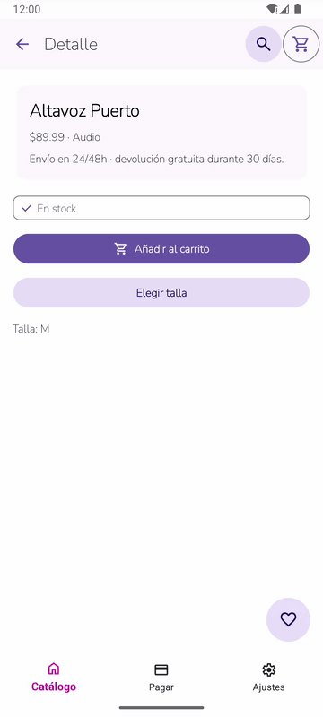
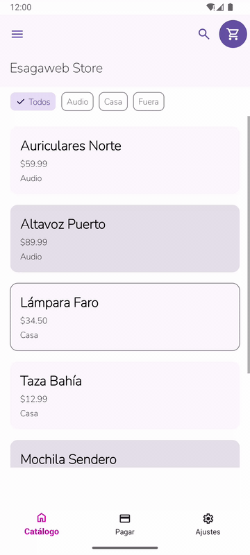
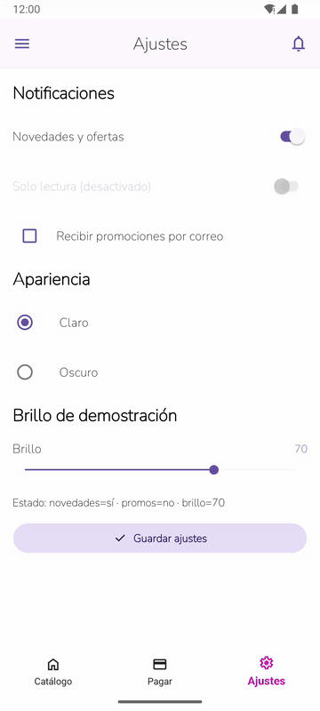

# Esagaweb.Maui.Android

**Material 3 for .NET MAUI Android — the Flutter feel, in XAML.**

[](https://github.com/aagarcia/esagaweb.maui.android/actions/workflows/ci.yml)
[](LICENSE)


[](CONTRIBUTING.md)

[Español](README.es.md)

If you've built UIs in Flutter and then opened a .NET MAUI project, you know the gap:
no `FloatingActionButton`, no `Card` variants, no `SnackBar` queue, no Material 3 color
scheme that switches between light and dark by itself. **Esagaweb.Maui.Android** fills that
gap: 19 ready-made Material 3 controls, 4,284 icons, light/dark theming and phone/tablet
breakpoints, all set up with **two lines of code**.

It's open source, it's young, and **it grows with every contribution**. There are many
Material 3 components still to build: pick one and it's yours (see [Roadmap](#roadmap)).

---

## Screenshots


<table>
  <tr>
    <td align="center"><br><sub>Cards, chips, top app bar</sub></td>
    <td align="center"><br><sub>Buttons, FAB, badge</sub></td>
    <td align="center"><br><sub>M3Dialog</sub></td>
    <td align="center"><br><sub>M3BottomSheet</sub></td>
  </tr>
  <tr>
    <td align="center"><br><sub>Snackbar</sub></td>
    <td align="center"><br><sub>Text fields, radio, checkbox</sub></td>
    <td align="center"><br><sub>Switches, slider</sub></td>
    <td align="center"><br><sub>Shell flyout</sub></td>
  </tr>
</table>

In motion:

<table>
  <tr>
    <td align="center"><br><sub>Dialog, snackbar with undo, FAB lifting</sub></td>
    <td align="center"><br><sub>Bottom sheet + radios</sub></td>
    <td align="center"><br><sub>Filter chips</sub></td>
    <td align="center"><br><sub>Live light/dark switch</sub></td>
  </tr>
</table>

Light and dark themes switch automatically with the system:

<table>
  <tr>
    <td align="center"><br><sub>Dark theme</sub></td>
    <td align="center"><br><sub>Dark theme: inputs</sub></td>
  </tr>
</table>

<sub>Taken from the included Sample app (its UI text is in Spanish) on an Android emulator.</sub>

---

## Why use it

- **Two-line setup.** `UseEsagaweb()` + `EsagawebThemes.Apply()`. No manual dictionary merges.
- **Real Material 3.** Baseline color scheme (seed `#6750A4`), type scale, shapes and elevation, with light and dark variants of every token.
- **Flutter-style icons.** `M3Icons.Add`, `M3Icons.FavoriteBorder`… 4,284 icons over Material Symbols, the same names you know from Flutter.
- **Responsive out of the box.** M3 breakpoints Compact / Medium / Expanded. For example, the navigation bar becomes a rail on tablets.
- **Your data stays yours.** Editable properties are `TwoWay`, and controls respect your `BindingContext`: no hidden `x:DataType`.
- **Fully documented.** XML-doc on every public API (IntelliSense) plus one page per component in [`docs/`](docs).
- **Tested and linted.** Unit tests plus CI on every PR, and builds are kept at zero warnings.

## Quick start

> Not on nuget.org yet: publishing it is on the roadmap. For now, reference the project from source.

```sh
git clone https://github.com/aagarcia/esagaweb.maui.android.git
```

In your app's `.csproj`:

```xml
<PropertyGroup>
  <MauiVersion>10.0.101</MauiVersion> <!-- same MAUI as the library, avoids NU1605 -->
</PropertyGroup>
<ItemGroup>
  <ProjectReference Include="path/to/Esagaweb.Maui.Android/Esagaweb.Maui.Android.csproj" />
  <!-- MauiFont items don't flow through ProjectReference: link the fonts -->
  <MauiFont Include="path/to/Esagaweb.Maui.Android/Resources/Fonts/*.ttf" />
</ItemGroup>
```

`MauiProgram.cs`:

```csharp
using Esagaweb.Maui.Android;

builder.UseMauiApp<App>().UseEsagaweb();
```

`App` constructor, after `InitializeComponent()`:

```csharp
EsagawebThemes.Apply();
```

That's it. You now have the fonts (`MaterialSymbols`, `NunitoRegular`, `NunitoSemiBold`) and
the six M3 resource dictionaries.

## A screen in 20 lines

```xml
<ContentPage xmlns:appbar="clr-namespace:Esagaweb.Maui.Android.Controls.TopAppBar;assembly=Esagaweb.Maui.Android"
             xmlns:fab="clr-namespace:Esagaweb.Maui.Android.Controls.Fab;assembly=Esagaweb.Maui.Android"
             xmlns:common="clr-namespace:Esagaweb.Maui.Android.Controls.Common;assembly=Esagaweb.Maui.Android">
    <fab:M3FabHost>
        <fab:M3FabHost.Body>
            <Grid RowDefinitions="Auto,*">
                <appbar:M3TopAppBar Title="Demo" />
                <Label Grid.Row="1" x:Name="CountLabel" Text="Taps: 0" />
            </Grid>
        </fab:M3FabHost.Body>
        <fab:M3FabHost.FabContent>
            <fab:M3Fab Glyph="{x:Static common:M3Icons.Add}" Clicked="OnFabClicked" />
        </fab:M3FabHost.FabContent>
    </fab:M3FabHost>
</ContentPage>
```

```csharp
private int _count;
private void OnFabClicked(object? sender, EventArgs e)
    => CountLabel.Text = $"Taps: {++_count}";
```

## Components

| Component | Docs | See it in the Sample |
|---|---|---|
| M3Button (5 variants) | [M3Button](docs/M3Button.md) | Checkout, Detail, Settings |
| M3Fab (3 sizes, 4 variants, extended) + M3FabHost | [M3Fab](docs/M3Fab.md) | Catalog, Detail |
| M3IconButton (4 variants) | [M3IconButton](docs/M3IconButton.md) | All screens |
| M3Card (Elevated / Filled / Outlined) | [M3Card](docs/M3Card.md) | Catalog, Detail |
| M3TopAppBar (Small / CenterAligned / Medium / Large) | [M3TopAppBar](docs/M3TopAppBar.md) | All screens |
| M3NavigationBar (bottom bar / rail) | [M3NavigationBar](docs/M3NavigationBar.md) | — |
| M3TextField (Filled / Outlined) | [M3TextField](docs/M3TextField.md) | Checkout |
| M3SwitchRow · M3CheckBoxRow · M3RadioRow · M3SliderRow | [Selection](docs/Selection.md) | Checkout, Settings |
| M3Dialog | [M3Dialog](docs/M3Dialog.md) | Detail |
| M3BottomSheet | [M3BottomSheet](docs/M3BottomSheet.md) | Detail |
| M3SnackbarHost (+ FIFO queue) | [M3Snackbar](docs/M3Snackbar.md) | All screens |
| M3LinearProgress · M3CircularProgress | [M3Progress](docs/M3Progress.md) | Catalog, Checkout, Settings |
| M3Chip (Assist / Filter / Input) | [M3Chip](docs/M3Chip.md) | Catalog, Detail |
| M3Badge | [M3Badge](docs/M3Badge.md) | Catalog, Detail |
| M3Icons (4,284 icons) | [M3Icons](docs/M3Icons.md) | Everywhere |

The **Sample** (`Esagaweb.Maui.Android.Sample`) is a small store app, *Esagaweb Store*,
built only from these controls: catalog, product detail, checkout and settings. It's the
best place to see how the pieces fit together.

## Roadmap

These are Material 3 components and improvements we'd love help with. Open an issue with
the **New component** template and claim one:

- [ ] Tabs (primary / secondary)
- [ ] Navigation drawer (modal + standard)
- [ ] Menus and dropdown menu
- [ ] Segmented buttons
- [ ] Search bar / search view
- [ ] Date & time pickers
- [ ] Lists and dividers
- [ ] Tooltips
- [ ] Carousel
- [ ] Draggable bottom sheet (it's modal-only today)
- [ ] Dynamic color / custom seed color theming
- [ ] Publish to nuget.org
- [ ] Show `M3NavigationBar` (bar + rail) in the Sample
- [ ] GIFs or screenshots for the doc pages that still lack them (a perfect first contribution)

## Contributing

Every contribution counts: a new component, a bug fix, a doc typo, a screenshot.

1. Read [CONTRIBUTING.md](CONTRIBUTING.md): setup, build commands and project rules.
2. Look for issues labeled `good first issue`, or pick something from the [Roadmap](#roadmap).
3. Fork the repo, create a `feat/…` or `fix/…` branch and open a PR.

Please follow our [Code of Conduct](CODE_OF_CONDUCT.md). To report a security issue, see [SECURITY.md](SECURITY.md).

## Requirements

- .NET 10 SDK with the `maui-android` workload
- JDK 21 for Android builds
- Android 5.0 (API 21) or later

## License

[MIT](LICENSE) © Alex Garcia A. / Esagaweb. Material Symbols and Nunito fonts under the SIL Open Font License.
